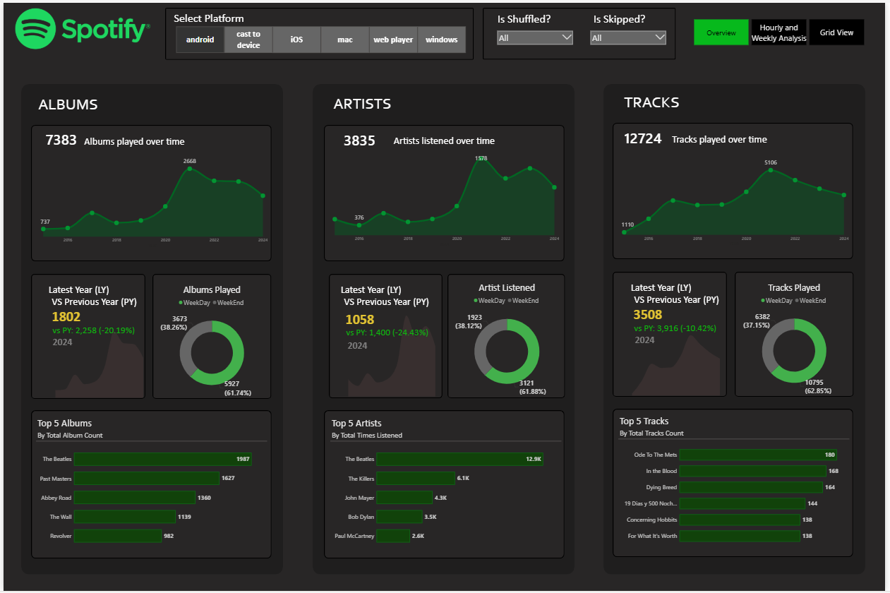
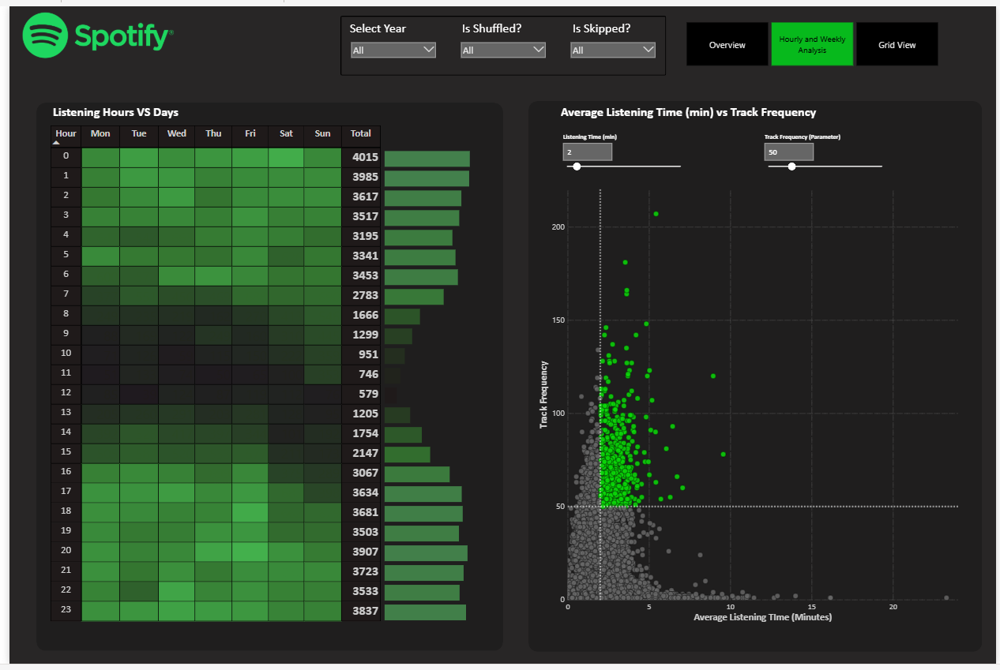

# 🎧 Spotify Power BI Report

A Power BI dashboard that analyzes Spotify streaming data to uncover music trends, artist popularity, genre influence, and track-level insights. Built with a focus on data storytelling and interactive KPI-driven visualizations.

---

## 📌 Table of Contents
- [Project Overview](#project-overview)
- [Live Dashboard Link](#live-dashboard-link)
- [Dataset](#dataset)
- [Key Features](#key-features)
- [Technologies Used](#technologies-used)
- [Insights Generated](#insights-generated)
- [Screenshots](#screenshots)
- [How to Run Locally](#how-to-run-locally)
- [Contact](#contact)

---

## 📝 Project Overview

This project showcases an interactive Power BI dashboard developed using Spotify’s Top Tracks dataset. It helps uncover meaningful patterns around:
- Popularity trends
- Artist dominance
- Genre distribution
- Track features (duration, tempo, etc.)

The dashboard provides actionable insights through dynamic filters, charts, and slicers — simulating a business intelligence solution for a music streaming service.

---

## 🌐 Live Dashboard Link

👉 [View the live Power BI report here](https://app.powerbi.com/view?r=eyJrIjoiNjQ5MWEyNzMtYjEyMC00ZGRmLTlhYmItYWFkMjc3OTU0ZGM5IiwidCI6IjE3MjBjMDM1LWEwYTMtNDYwYS05YTE1LWExOWU5NTYyNWNjMyJ9)  

---

## 📂 Dataset

The dataset used in this project is a **personal Spotify listening history log**, obtained from a google drive link made available for a contest. It includes detailed information on every track played, playback method, platform used, and user interaction.

**📁 File:** `spotify_history.csv`

### 🧾 Key Columns:
| Column             | Description |
|--------------------|-------------|
| `spotify_track_uri` | Unique Spotify track ID |
| `ts`               | Timestamp of when the track was played |
| `platform`         | Device/app used (e.g., web player) |
| `ms_played`        | Duration played in milliseconds |
| `track_name`       | Name of the track |
| `artist_name`      | Artist performing the track |
| `album_name`       | Album name |
| `reason_start`     | How the track started (e.g., clickrow, autoplay) |
| `reason_end`       | How playback ended (e.g., trackdone, skip) |
| `shuffle`          | Whether shuffle mode was enabled |
| `skipped`          | Whether the track was skipped |

This data supports rich behavior-based analytics like:
- Listening time trends
- Most played artists and tracks
- Skip behavior analysis
- Platform usage patterns

---

## ✨ Key Features

- 📈 **Top Artists & Genres**: Discover who dominates Spotify’s charts.
- 🕒 **Track Duration Analysis**: See how length impacts popularity.
- 🎵 **Genre-wise Popularity**: Explore the most engaging genres.
- 🔍 **Interactive Filters**: Slicers for artist, genre, year, and track popularity.
- 📊 **Clean UI**: Modern layout with dynamic visuals and bookmarks.

---

## 🛠 Technologies Used

- **Power BI Desktop** – Data modeling and dashboard creation
- **Power Query** – Data transformation and cleaning
- **Excel** – Dataset handling
- **DAX** – Measures and calculated fields

---

## 📈 Insights Generated

- **Most played artists** reflect consistent listening patterns.
- **Skip behavior** insights help identify tracks with low engagement.
- **Web Player** was the most-used streaming platform.
- Listening habits reveal **peak hours** and days for music consumption.

---

## 📸 Screenshots

> 📍 Add screenshots in a `/screenshots/` folder and embed them like below:

---

## 💻 How to Run Locally

1. Clone or download this repository
2. Open `SpotifyReport.pbix` using Power BI Desktop
3. Refresh the dataset if needed and explore the visuals

---

## 📬 Contact

Made with 💙 by **Harsh Soni**  
📧 GitHub: [@HarshSoni69](https://github.com/HarshSoni69)  

---

## 📝 License

This project is for educational and non-commercial purposes only.  
Data credit goes to the respective sources.

